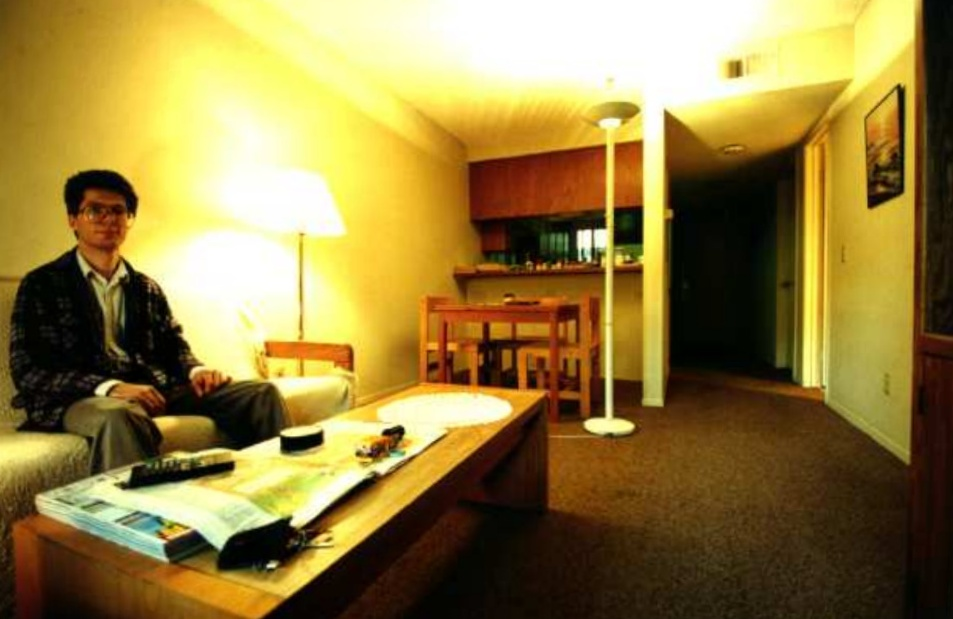
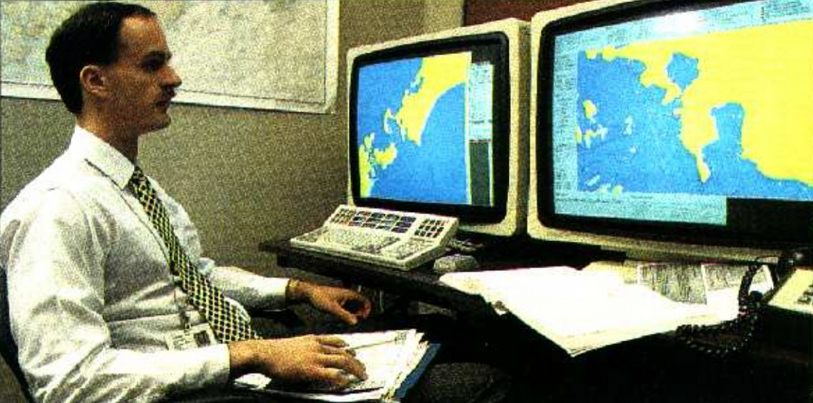
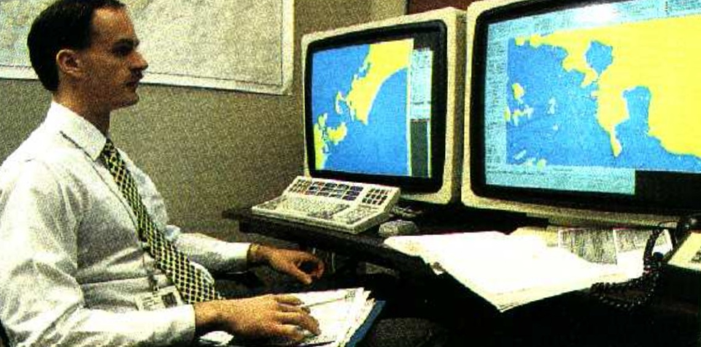

  
  
  
  
Imput | Zorin and Barr [1] | Shih et al. [2] | Ours
--- | --- | --- | ---
 |  |  | 
 |  |  | 
    
Imput | Samsung Face Shape Correction [3] | Shih et al. [2] | Ours
--- | --- | --- | ---
 |  |  | 
 |  |  | 
 |  |  | 
    
Imput | Photoshop Perspective Warp [4] | Shih et al. [2] | Ours
--- | --- | --- | ---
 |  |  | 
    
Imput | DxO ViewPoint [5] | Shih et al. [2] | Ours
--- | --- | --- | ---
 |  |  | 
 |  |  | 
    
Imput | Tehrani et al. [6] | Shih et al. [2] | Ours
--- | --- | --- | ---
 |  |  | 
    
[1] Denis Zorin and Alan H. Barr, “Correction of geometric perceptual distortions in pictures,” in SIGGRAPH, 1995, p. 257–264.  
[2] YiChang Shih, Wei-Sheng Lai, and Chia-Kai Liang, “Distortion-free wide-angle portraits on camera phones,” ACM Transactions on Graphics, vol. 38, no. 4, 2019.  
[3] Samsung, “About shape correction,” https://www.samsung.com/nz/support/mobiledevices/galaxy-s7-about-shape-correction/, 2017.  
[4] Chintan Intwala and Aseem Agarwala, “Perspective warp,” US Patent 9,117,253, 2015.  
[5] DxO, “Dxo viewpoint features,” https://www.dxo.com/dxo-viewpoint/features/, 2015.  
[6] M. A. Tehrani, A. Majumder, and M. Gopi, “Correcting perceived perspective distortions using object specific planar transformations,” International Conference on Computational Photography (ICCP), 2016, p. 1–10.